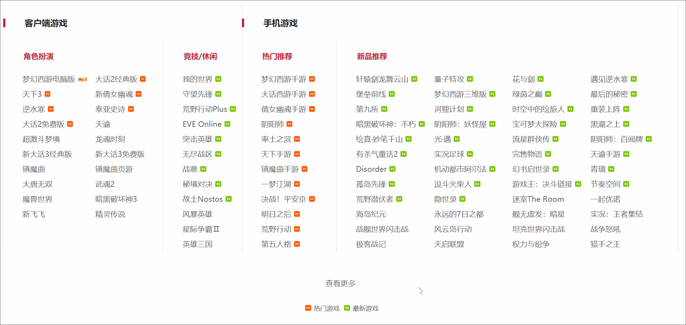

# WebAPI第二天作业

## 填空题

大家直接在当前 `md` 文件上编辑内容。

如果想要学习 `MarkDown` 语法，可以点击 `Typora` 软件底部的源码模式，或者按快捷键 `Ctrl+/` 查看源码。

### 获取元素

`getElement` 系列三个获取元素的方法：

```js
getElementById
getElementByClassName
getElementsByTagName
```

通过选择器 `Selector` 获取元素两个方法：

```js
querySelector
querySelectorAll
```

### 元素的属性操作

写出至少 5 个标签标准属性。

```js
class
id
disabled
checked
selected
```

自定义属性的 HTML 标签写法

```
<a index="0">
```

获取和设置元素标准属性。

```js
获取：getAttribute
设置：setAttribute
```

获取和设置自定义属性。

```js
获取：getAttribute
设置：setAttribute
删除：removeAttribute
```

获取属性，设置属性，移除属性的**方法**。

主要注意函数三要素，请填空下面表格。

| 功能     | 方法名          | 参数个数 | 是否有返回值  |
| -------- | --------------- | -------- | ------------- |
| 获取属性 | getAttribute    | 1        | 有            |
| 设置属性 | setAttribute    | 2        | 无：undefined |
| 移除属性 | removeAttribute | 1        | 无：undefined |

## 作业

大家结合之前学习的 HTML +CSS 美化一下效果的布局，并实现 JS 效果。

### 1. 网易游戏查看更多 - 开关思想

思路：

- 布局的时候，需要把有动画效果的盒子定义成两种状态
  - 状态1：一种盒子高度为 0。
  - 状态2：另一种为正常状态的高度。
- 点击按钮的时候，事件处理函数内部主要两个效果
  - 效果1：按钮自身文字发生变化
  - 效果2：切换两种状态，让盒子高度发生变化，动画效果通过 CSS3 过渡实现即可。

参考网址：https://game.163.com/



### 2. 阴阳师右侧广告 - 开关思想-

思路：

- 布局的时候，把盒子固定定位到页面最右边。
- 效果分为两种状态
  - 状态1：盒子通过 right 负值把盒子移动到页面外
  - 状态2：盒子在页面中正常显示
- 点击按钮的时候，事件处理函数内部主要两个效果
  - 效果1：按钮自身文字发生变化，图标通过 CSS3 旋转可以实现反向。
  - 效果2：切换大盒子的两种状态，动画效果通过 CSS3 过渡实现即可。

参考网址：http://yys.163.com/


### 3. 小米轮播图 - 排他思想

思路：

- 本质就是 tab 栏的升级版，只不过多了动画效果，动画效果交给 CSS3 的过渡即可。
- 布局的时候，所有的图片需要通过定位堆叠在一起
- 点击的时候小圆点自身需要添加类名变特别，同级的其他小圆点移除类名变普通。
- 图片显示的时候其实是当前图片的透明度变1，其他图片的透明度变成 0。
- 显示的图片需要有层级的提升。

参考网址：https://www.mi.com/


### 4. 京东排行榜-

参考网址：https://www.jd.com/

思路

- tab 栏其他形式 - 商品部分截图填入即可


## 预习 - 事件类型填空

自行查阅手册完成下方表格填空

### 鼠标事件类型

| 事件类型 | 英文单词        |
| ---- | ----------- |
| 鼠标单击 | `click`     |
| 鼠标双击 | ondblclick  |
| 鼠标移入 | onmouseover |
| 鼠标移出 | onmouseout  |
| 鼠标移动 | onmousemove |
| 鼠标按下 | onmousedown |
| 鼠标弹起 | onmouseup   |

### 表单事件类型

| 事件类型 | 英文单词    |
| ---- | ------- |
| 获取焦点 | onfocus |
| 失去焦点 | onblur  |


