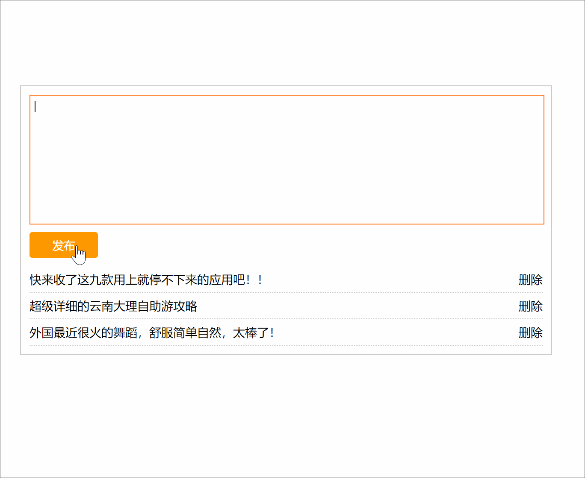

# WebAPI03 作业

## 填空题

### 文档操作术语

常见术语和对应的单词 !!!

```
文档:  document
节点:  node
元素:  element
```

### 文档操作方法名

| 功能    | 方法名             | 备注   |
| ----- | --------------- | ---- |
| 创建元素  | `createElement` |      |
| 后添加元素 | `appendChild`   |      |
| 插入元素  | `insertBefore`  |      |
| 移除元素  | `removeChild`   |      |
| 替换元素  | `replaceChild`  |      |
| 克隆节点  | `cloneNode`     |      |

insertBefore 方法思考题：

> insertBefore() 方法允许传入两个参数，请实现在父元素最后添加子元素。(仿 appendChild 功能)

```
father.insertBefore(newElement, father.children[father.children.length])
```


### DOM 树节点关系获取元素

| 功能      | 属性名                        | 备注   |
| ------- | -------------------------- | ---- |
| 父元素/父节点 | parentElement / parentNode |      |
| 子元素集合   | children                   |      |

children 属性用法思考题：

> 用 children 属性实现选中第一个子元素和最后一个子元素。

```js
第一个子元素：		children[0]
最后一个子元素：	children[children.length - 1]
```


## 实操题

微博发布效果

功能：

1. 查找元素
    1.1 查找发布按钮
    1.2 查找文本域
    1.3 查找新闻列表分区
2. 点击发布按钮
    2.1 获取文本域的内容, 修剪首尾空格
    2.2 判断是否为空，提示空内容
    2.3 判断是否超过 120 长度，提示内容过长
    2.4 创建个新的li，把文本域的内容作为li的内容
    2.5 把新建的 li 插入到 ul 的最前面
    2.6 发布成功后把文本域里面清空
3. 点击删除按钮
     3.1 把获取到的对应父级 li 在页面中移除
4. 按 Ctrl + 回车键 也可以发布

​    




